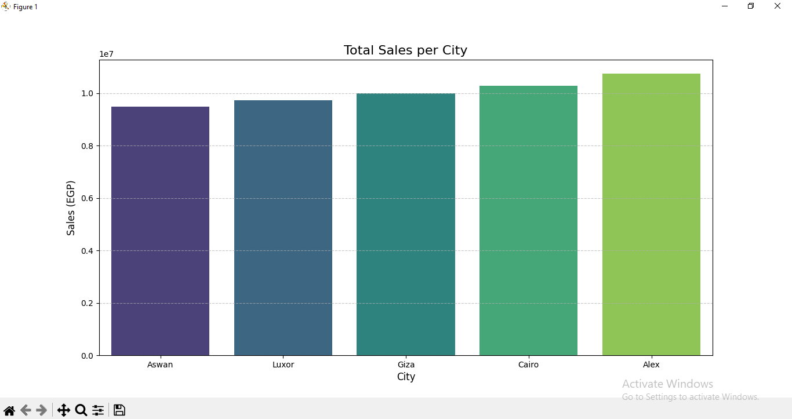

# 🚀 My Data Science Journey

### 📝 Overview
This repository documents my journey in mastering **Data Science**. It features practical projects demonstrating my skills in Python, NumPy, Pandas, and **Data Visualization**.

---

## 📊 Project Highlights

*Visualizing sales performance across different cities using Matplotlib & Seaborn.*

---

## 📂 Projects

### 1. 🛒 Supermarket Sales Analysis (`analysis.py`)
A comprehensive project that transforms raw retail data into actionable business insights and visual charts.
* **Key Skills:** Data Cleaning, Feature Engineering, Grouping (GroupBy), Pivot Tables, and **Data Visualization**.
* **Technology:** Python, Pandas, Matplotlib, Seaborn.

### 2. 💼 Corporate Sales Simulator (`sales_simulator.py`)
A simulation project using **2D NumPy Arrays** to analyze sales data for a company with multiple branches.
* **Key Skills:** Matrix operations, Data Filtering, Aggregation (Sum/Mean), and Critical Incident Detection.
* **Technology:** Python, NumPy.

### 3. 📈 Student Grades Analyzer (`grades_analysis.py`)
A foundational script for statistical analysis of student grades.
* **Key Skills:** Array creation, Basic Statistics (Mean/Max/Min).
* **Technology:** Python, NumPy.

---

### 🛠️ Tools & Technologies
* **Languages:** Python 3.x
* **Libraries:** Pandas, NumPy, Matplotlib, Seaborn
* **Tools:** VS Code, Git & GitHub
