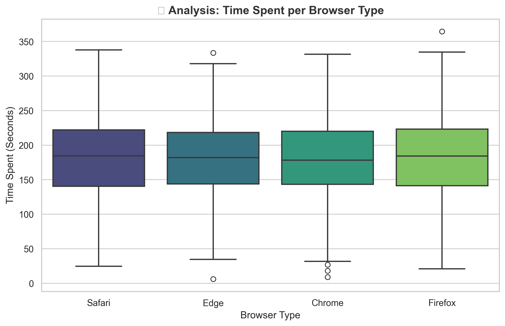
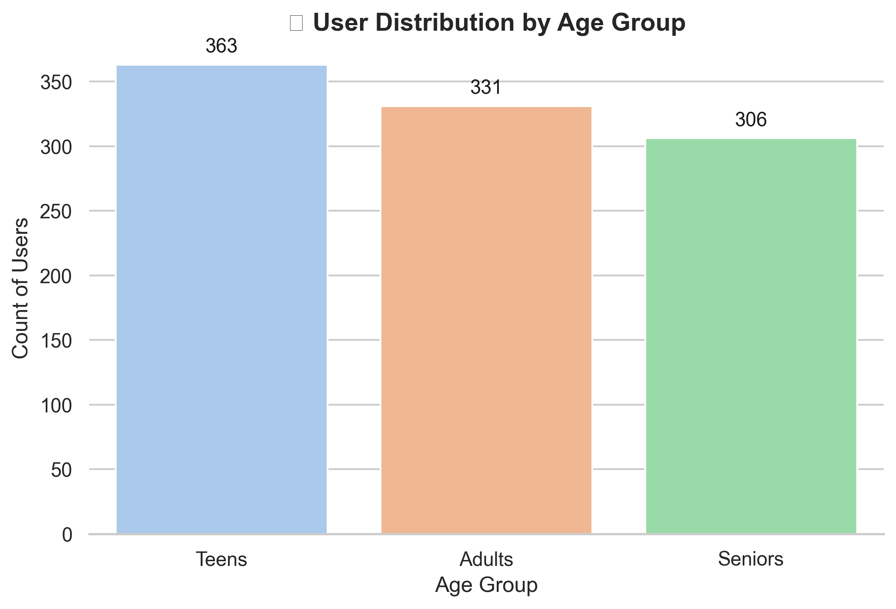
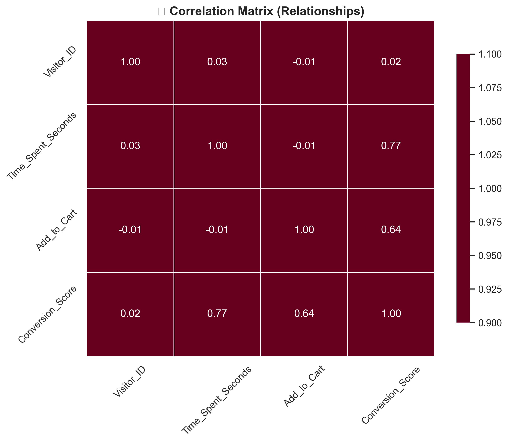

# 🚀 My Data Science Journey

### 📝 Overview
Welcome to my portfolio! This repository documents my path to mastering **Data Science**. It showcases a progression of projects moving from basic array manipulation to complex **User Behavior Analysis** and **Data Visualization**.

---

## 🌟 Featured Project: E-Commerce Behavior Lens
**File:** `ecommerce_analytics.py`

A sophisticated simulation project analyzing **1,000 user sessions** for an e-commerce platform. It integrates **NumPy** for data generation, **Pandas** for feature engineering, and **Seaborn** to reveal hidden patterns.

### 📊 Key Visualizations
| Browser Analysis | User Segments | Correlation Matrix |
| :---: | :---: | :---: |
|  |  |  |
| *Time spent per browser* | *User demographics* | *Conversion drivers* |

> **Business Insight:** The analysis explores the relationship between "Time Spent" on the site and the likelihood of "Adding to Cart", helping marketing teams target the right audience.

---

## 📂 Project Archive

### 1. 🛒 Supermarket Sales Analysis (`analysis.py`)
Transforming raw retail data into actionable insights using **Pandas**.
* **Chart:** 
* **Skills:** Data Cleaning, Grouping (GroupBy), Pivot Tables, Reporting.
* **Tech:** Python, Pandas, Matplotlib.

### 2. 💼 Corporate Sales Simulator (`sales_simulator.py`)
Using **2D NumPy Arrays** to simulate and analyze branch performance.
* **Skills:** Matrix operations, Data Filtering, Critical Incident Detection.
* **Tech:** Python, NumPy.

### 3. 📈 Student Grades Analyzer (`grades_analysis.py`)
A foundational script for statistical analysis.
* **Skills:** Array creation, Basic Statistics (Mean/Max/Min).
* **Tech:** Python, NumPy.

---

### 🛠️ Technical Skills Acquired
* **Data Manipulation:** Pandas (DataFrames, Merging, Cleaning).
* **Numerical Computing:** NumPy (Broadcasting, Random Distributions).
* **Visualization:** Seaborn (Heatmaps, Boxplots), Matplotlib (Customizing layouts).
* **Analysis:** Correlation Matrices, Feature Engineering, Statistical Summaries.

---
*Created with ❤️ and Python.*
